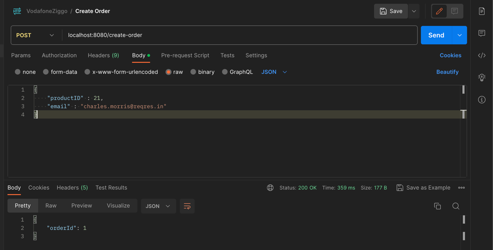
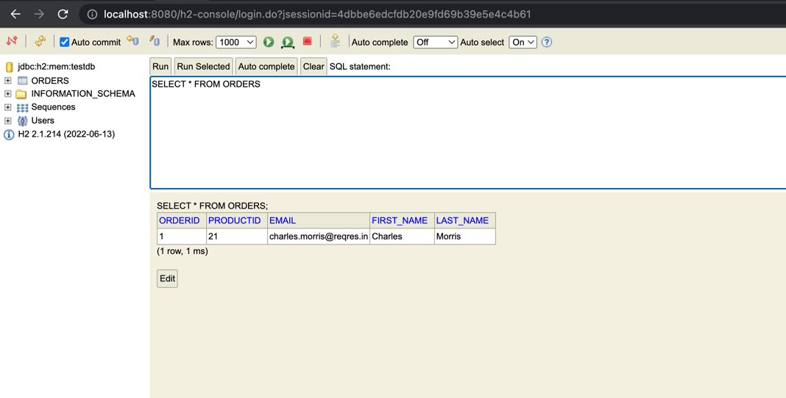
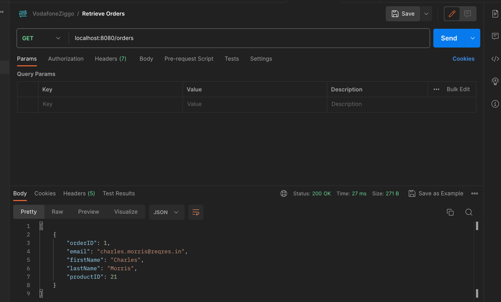

# order-app

<h3 align="center">Backend Application for Orders</h3>  

The RESTful API allows users to order products and see the ordered products info.

<h3> Functional Requirements </h3> 
● Create an order:  
    a. The order looks like this: {"productID": "1234", "email": "abc@def.com"} 
    b. The order is only valid when the "email" exists in https://regres.in/api/users  
    c. The order is only valid when the customer has not ordered this product already. 
    d. Store the order in a database of choice (order|D, email, first_name, last_name, productID) 
    e. Return the orderlD 
● Retrieve all orders:  
    Return a list of all orders (orderlD, email, first_name, last_name, productID)

<h3> Features:</h3>
Springboot 
H2 
Swagger 
Unit Test  
Docker  
FeignClient  
   

| Method | Url                        | Description                            |
| ------ |----------------------------|----------------------------------------| 
| POST   | /create-order              | Create order                           | |
| GET    | /orders                    | This method is used to find all orders |

<h3> Swagger Link:</h3>

http://localhost:8080/swagger-ui/index.html

●  <b>Create Order </b>

localhost:8080/create-order

{
"productID" : 21,
"email" : "charles.morris@reqres.in"
}

The result in h2 db:

Db link : http://localhost:8080/h2-console/

●  <b> Retrieve Orders </b>

<h3> Run the application in docker:</h3>

First build the docker image with this command:  
docker build -t order-app . 

And then run the container with generated image:  
docker run -d -it  -p 8080:8080 --name order-app order-app  
